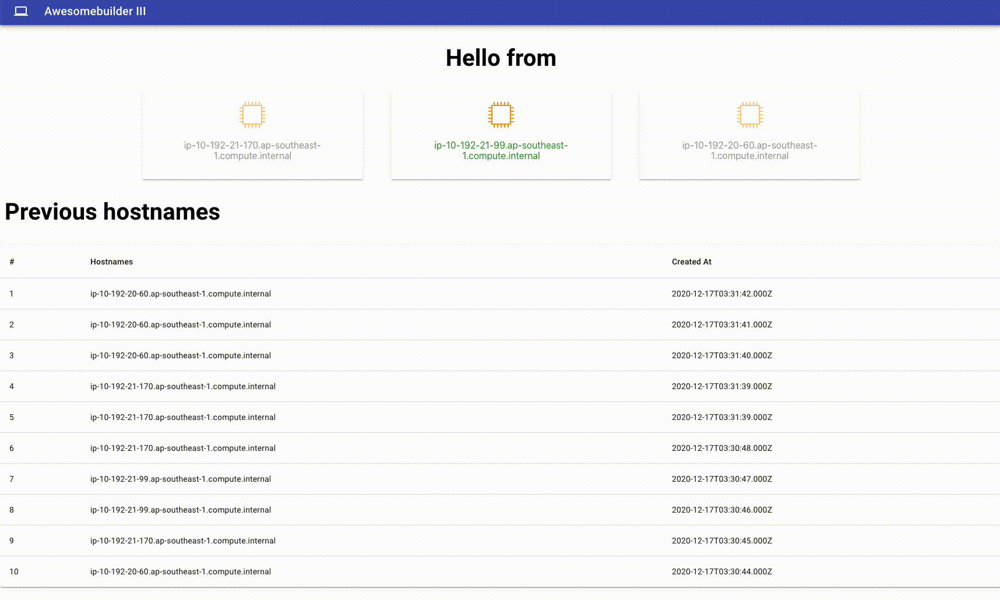

# Getting Started with Create React App

This project was bootstrapped with [Create React App](https://github.com/facebook/create-react-app).

## Build status

## Objective

### Why?
It is often difficult to visualize and understand how request are being distributed by the application load balancer to the servers

### How will this web application help?

The top section provides an overview of number of running instances. Instance serving the request is highlighted in green.
In addition, the record of the instance meta data is inserted into a persistent storage, RDS. 
The table shows the history of instances that have served a request 

## Screenshots

## Available Scripts

In the project directory, you can run:

### `npm start`

Runs the app in the development mode.\
Open [http://localhost:3000](http://localhost:3000) to view it in the browser.

The page will reload if you make edits.\
You will also see any lint errors in the console.

### `npm test`

Launches the test runner in the interactive watch mode.\
See the section about [running tests](https://facebook.github.io/create-react-app/docs/running-tests) for more information.

