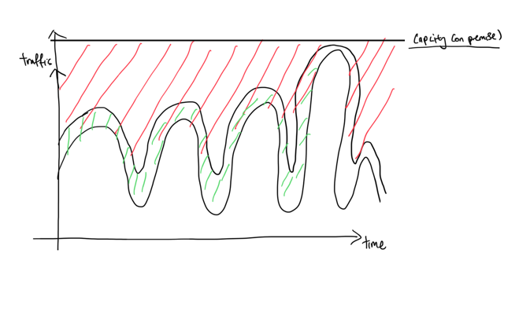
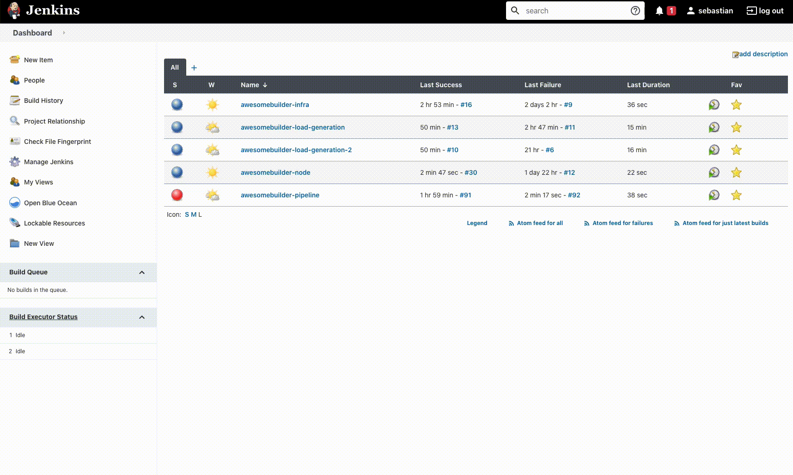
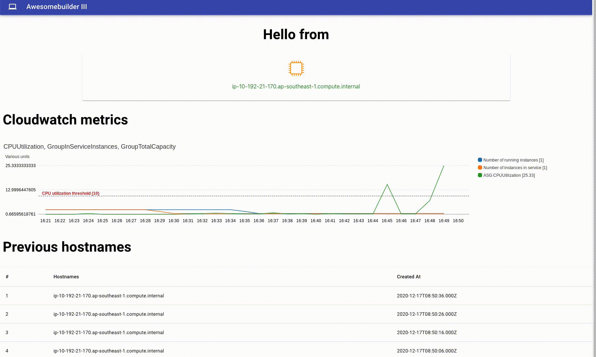

## Build status

## Objective

### Why?
It is often difficult to visualize and understand how elasticity works in AWS. 

### How will this demo help?
This demo aims to showcase how an application is able to cope with spiky traffic by increasing the number of compute instances based on CPU utilization 

### What is included in the demo?

#### Web UI

The Web UI consist of 3 sections: 
1. [Web UI - Cloudfront](https://d36du6tgphs6li.cloudfront.net/)
2. [Web UI - ALB](http://webse-appli-wvdu5rb0sit7-1557819975.ap-southeast-1.elb.amazonaws.com/)

##### 1. No. of running instances
This section provides an overview of the number of running instances. 
Instance serving the request is highlighted in "Green" while instances that are "running" are displayed in "Grey"

##### 2. Cloudwatch metrics
This section provides the
 
1. Overall CPU utilization of the Auto-Scaling Group (ASG) instances, 
2. Total number of "running" instances
3. Total number of instance in service that are able to respond to request 

##### 3. Recorded hostnames
This section provides a historical list of instance metadata that has served a request 

#### How to get started?

##### Generating traffic

Each task will opens 100 connections and send 5000 request every 10 seconds for 4 mins

##### What to expect?

Due to load generation, group CPU utilization will increase over the threshold of 10%. Auto scaling group will be triggered to add additional resources. Once provision, the instance will need pass health check for the next 20 seconds before being added to the application load balancer. 

---

### Infrastructure

We use [Cloudformation](https://github.com/sebastianlzy/awesomebuilder-infra) to provision our infrastructure

---

### Continuous integration/Continuous Deployment

Existing [Jenkins server](http://ec2-3-1-6-16.ap-southeast-1.compute.amazonaws.com/) and [Ansible script](https://github.com/sebastianlzy/awesomebuilder-ansible) can be repurposed to deploy application to AWS 

---

### Estimated Total Cost of Ownership (TCO)

#### Assumptions
1. Operates mainly out of Asia Pacific (Singapore)
2. Workload is a small web application that uses resources in equal proportion
3. 	Most of the traffic happens between 0800 - 2200 (10 hours), with uncertain and unpredictable usage pattern
4. A total of 10,000 users, with an average of 1 requests per second
5. Each request last an average of 1 second and transfer around 300KB of data
6. An estimated usage of 1TB of object storage usage
7. Compute resources needed
	1. 	2 baseline instances - minimum needed for non-peak user traffic
	2. 4 peak instances - maximum needed to handle spike
8. Usage of Multi AZ for High availability

 

#### Service breakdown

Estimated total cost of running this workload: **~$900.00/month** or **~$0.09/customer**

| Service	| Pricing | Per month	| Estimated Cost ($)|
| --- 		| --- 		| --- 		| --- 	|
| Cloudfront | $0.140/GB | 300kb * 3600 request per hour * 300 hours | $45.36 |
| S3 | $0.025/GB | 1000GB | $25 |
| ELB, Application Load balancer  | $0.0252/hour | 720 hour | $18.10|
| Nat Gateway | $0.059/hour | 720 * 2 gateway | $85 |
| Nat Gateway - Data processed| $0.059/GB | 50GB * 2 gateway | $5.90
| EC2, T3.large - 2 vcpu, 8GiB  | $0.1056/hour | 720 hour * 2 instances | $152.01 |
| EC2, T3.large - 2 vcpu, 8GiB| $0.1056/hour | 300 hour * 4 instances | $126.72|
| RDS compute - Multi AZ (T3.large) | $0.416/hour | 720 hour | $299.52|
| RDS storage - Multi AZ (20GB) | $0.276/GB | 500 GB | $138|

#### Cost optimization

1. Reserved instance
    1. Amazon EC2 Reserved Instances (RI) provide a significant discount (up to 72%) compared to On-Demand pricing 
2. Spot instance
    1. Run fault-tolerant workloads for up to 90% off

#### References
1. https://media.amazonwebservices.com/AWS_TCO_Web_Applications.pdf

