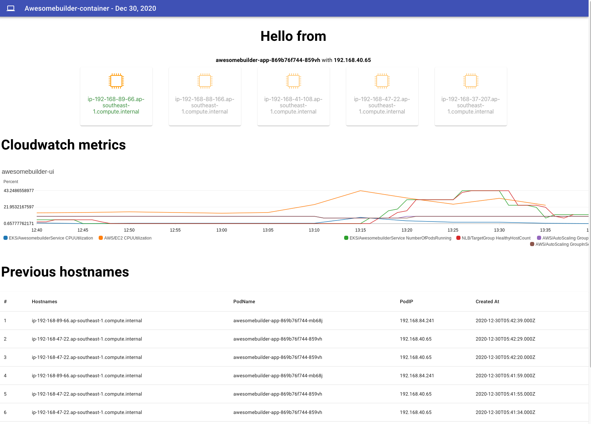

## Objective

### Why?
It is often difficult to visualize and understand how elasticity works in EKS. 

### How will this demo help?
This demo aims to showcase how an application is able to cope with spiky traffic by 

1. increasing the number of pod 
2. increasing the number of nodes 

### What is included in the demo?

#### Web UI



The Web UI consist of 3 sections: 
2. [Web UI - ALB](http://k8s-default-awesomeb-c423295acd-be9479a82d3a0b69.elb.ap-southeast-1.amazonaws.com/)

##### 1. No. of running instances
This section provides an overview of the number of running nodes and provide information about the Pod name and pod IP address that is serving the request. 
In addition, highlighted in "Green" is the node serving the request while "Grey" signifies "running" status. 

##### 2. Cloudwatch metrics
This section provides the
 
1. Overall CPU utilization of the Auto-Scaling Group (ASG) instances, 
2. Overall CPU utilization of the Awesomebuilder service, 
3. Total number of running pods in Amazon Elastic Kubernetes Service (EKS)
4. Total number of healthy host registered to Network Load Balancer (NLB)
5. Total number of nodes in ASG

##### 3. Recorded hostnames
This section provides a historical list of instance hostname, pod name and pod IP address that has served a request 

#### How to get started?

##### Generating traffic

Each task will opens 100 connections and send 5000 request every 10 seconds for 4 mins

##### What to expect?

Due to load generation, pod CPU utilization will increase over the threshold of 50%. Horizontal pod scaling will attempt to increase the number of pods n order to achieve the desired cpu utilization for the service.
When pods are unable to be scheduled due to resource constrains, cluster autoscaler will attempt to increase the number of nodes through ASG. 
Pod that are running will be automatically registered to the NLB so as to serve live traffic 

---

### Infrastructure


---

### Continuous integration/Continuous Deployment

```
# To deploy latest commit change
npr publish
``` 

---

### Screenshots


